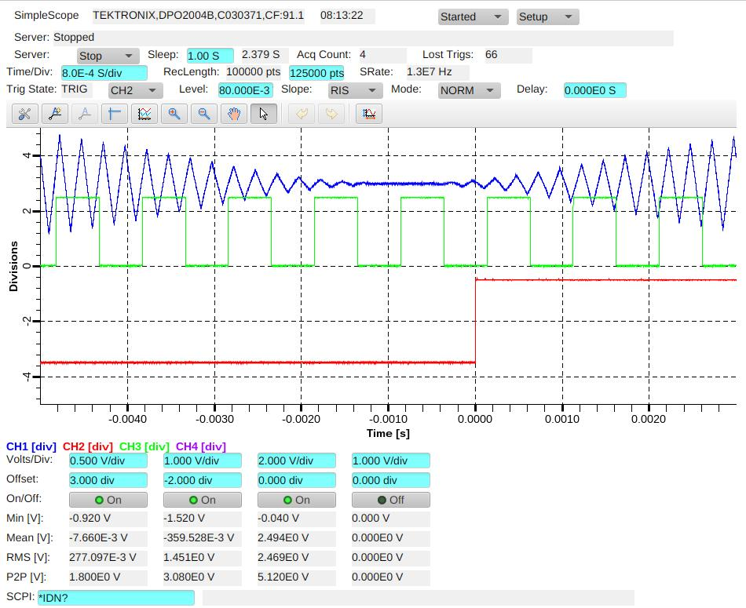

# epicsdev_osc_tektronix_mso

An EPICS PVAccess server for Tektronix MSO and DPO oscilloscopes, built with [`epicsdev`](https://pypi.org/project/epicsdev/).



Tested with:

* Tektronix MSO64B over TCP/IP
* Tektronix DPO2004B over USB

## Features

* TCP/IP, USB, and GPIB connectivity through VISA
* Per-channel control and readback of key oscilloscope parameters
* Model-aware setup, including automatic channel-count handling
* Included generator for a basic Phoebus operator screen

## Performance

Measured waveform-transfer performance:

| Oscilloscope | Connection    |                     Throughput |
| ------------ | ------------- | -----------------------------: |
| MSO64B       | TCP/IP SOCKET | ~1 million `float32` samples/s |
| DPO2004B     | USB           |    ~80,000 `float32` samples/s |

Actual performance depends on the instrument, VISA backend, network, and waveform settings.

## Requirements

Python 3.11 or later, `p4p>=4.2.2`, `epicsdev>=3.0.1`, `numpy`, `pyvisa` and a compatible VISA backend, such as `pyvisa-py`.

## Installation

```bash
pip install epicsdev_osc_tektronix_mso
```

## Running the server

Start the server with a VISA resource string:

```bash
python -m epicsdev_osc_tektronix_mso -r 'TCPIP::192.168.1.1::4000::SOCKET'
```

The default EPICS PV prefix will be: `tektronix0:`

## Phoebus OPI

Generate a simple Phoebus oscilloscope screen:

```bash
cd opi
python generate_simplescope.py -t txMSO1 pva://tektronix0:
```

This creates [`opi/simplescope.bob`](opi/simplescope.bob).

Notes:

* The `prefix` argument determines the PV names used by widgets.
* The default prefix is `$(DEV):`, allowing the screen to use Phoebus macros.
* Install the optional generator dependency if needed:

  ```bash
  pip install phoebusgen
  ```

## Connection notes

* For TCP/IP, VISA `INSTR` resources are typically more reliable; `SOCKET` resources can provide faster large-waveform transfers.
* USB connections can be slow and less reliable on older instruments.
